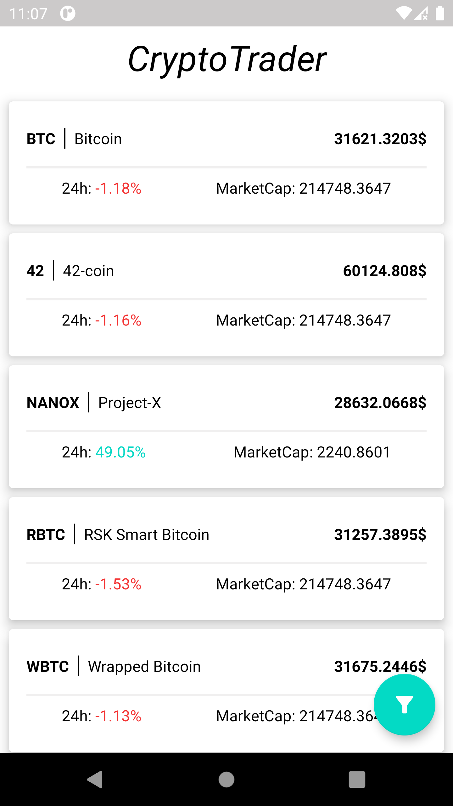
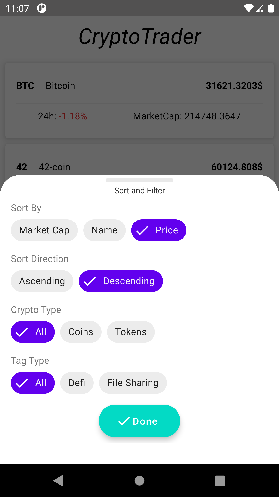

# CryptoTrader
get the latest digital currency prices instantly
currency list | sort and filter 
| --- | --- |
 |  | 
#  About Project
CryptoTrader is a simple app that shows all digital currencies price and other info.
# Run Project 

 - First create a local.properties in root folder
 - Get a  [CoinMarket](http://coinmarketcap.com/)  Api Key and add to the properties file with "api_key" tag
 Now you can open the project in AndroidStudio and build/Test/Run it.
 # Technologies
- [Kotlin](https://kotlinlang.org/) 
- [AndroidX](https://developer.android.com/jetpack/androidx)
- [Android Jetpack](https://developer.android.com/jetpack)
- Android Clean MVVM architecture
- Android Multi Module Project 
- [Dagger2](https://dagger.dev/users-guide)
- [Retrofit](https://github.com/square/retrofit)
- [OkHttp](https://github.com/square/okhttp)
- [Kotlin Serialization](https://github.com/Kotlin/kotlinx.serialization)
- [LeakCanary](https://github.com/square/leakcanary)
- [Lottie](https://airbnb.design/lottie/)
- [Junit](https://junit.org/junit4/)
- [Mockito Kotlin](https://github.com/mockito/mockito-kotlin)
- [Truth](https://truth.dev/)
# TODO
* Create Cryptocurrency Details Page

# Contributing
Contributions are most welcome to CryptoTrader. You can contribute in various ways such as reporting issues, suggesting features, adding documentation and providing bug fixes.
